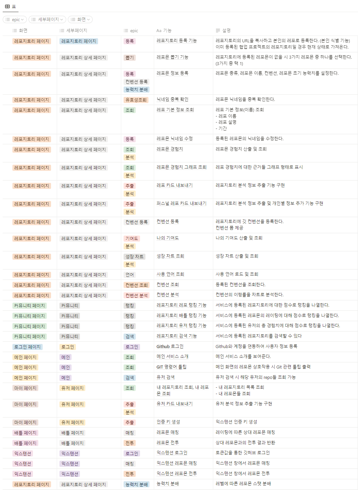
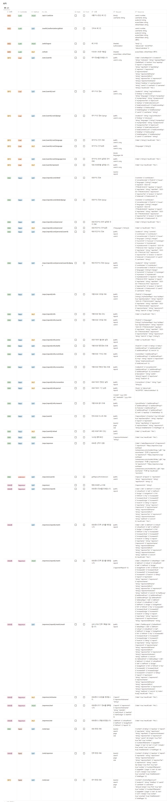
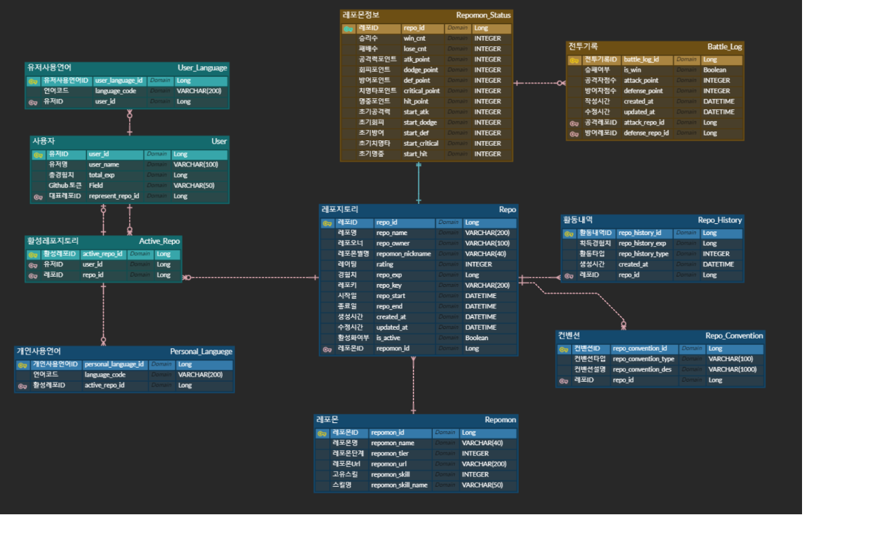
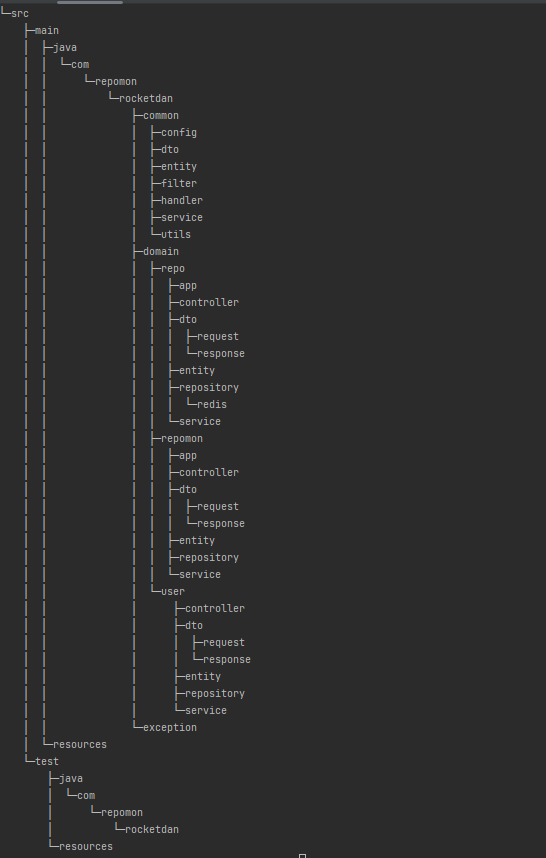
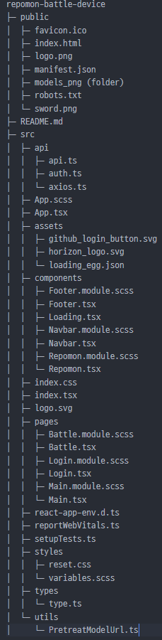
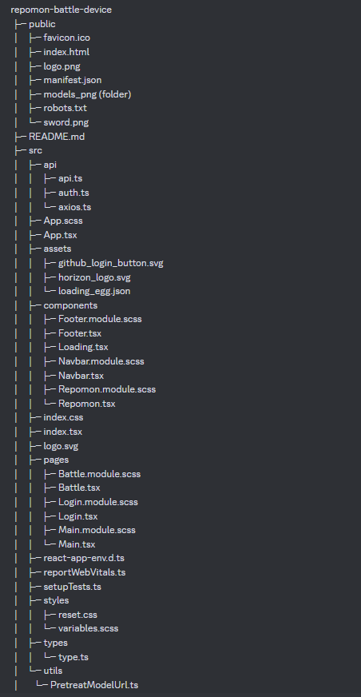
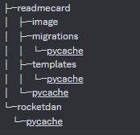
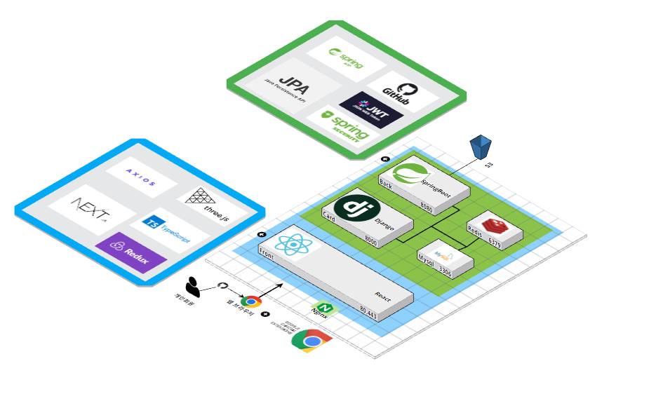

# 🐱‍👤 RepoMon 🐱‍👤

SSAFY 8기 2학기 자율프로젝트

2023.04.10 ~ 2023.05.19

## ☁ 목차

[TOC]

## 🐀 서비스 소개

Github의 사용자는 나날이 증가하는 가운데, 프로젝트의 지표를 설명할 도구들은 마땅치 않은 상황입니다.

"레포몬"은 이러한 프로젝트의 정보를 분석 및 요약하여 레포지토리를 대표하는 캐릭터와 함께 한 장의 카드로 만들어 나타낼 수 있게 하는 서비스입니다.

 먼저 **레포지토리 분석 기능**에서는 레포지토리의 정보를 가져와 커밋, 머지, 이슈, 리뷰, 포크, 스타를 점수화 시켜 총 경험치를 나타내줍니다. 또한 컨벤션을 등록하여 준수율을 확인하고, 각 커밋의 기여도를 유저 별로 나타낼 수 있습니다.

 다음으로 **정보 카드 생성**입니다. 사용자의 정보를 요약한 유저 카드, 레포지토리의 정보를 요약한 레포 카드, 해당 레포지토리에서 본인의 기여도 및 언어를 선택하여 제작할 수 있는 퍼스널 레포 카드 세 가지를 생성할 수 있습니다.

 마지막으로 **레포몬 배틀**입니다. 앞서 획득했던 경험치를 토대로 레포몬을 진화 및 성장시킬 수 있으며, 나만의 레포몬과 다른 사람의 레포몬을 배틀을 통해 경쟁시킬 수 있습니다.

이러한 기능을 통해 프로젝트를 활성화하고, 레포지토리의 분석 결과를 리드미에 작성해보세요 ✨

## 🐂 소개 영상
### [구글 드라이브 링크](https://drive.google.com/file/d/17gf3iummO-fu-awmFWhAsgmPPZxklRNe/view?usp=share_link)

## 🐅 주요 기능
- 레포지토리 분석
- 레포지토리 요약 카드
- 레포몬 육성
- 레포몬 배틀
- 랭킹 시스템

## 🐇 기능 명세서

## 🐉 API 명세서

## 🐍 ERD

## 🐎 프로젝트 구조
#### Back_디렉토리 구조

#### Front_디렉토리 구조

#### Extension_디렉토리 구조

#### Django_디렉토리 구조

## 🐑 아키텍처 구조

## 🐒 팀원 소개

<table>
  <tbody>
    <tr>
        <td align="center">
        <a href="https://github.com/ddings73">
            
             
            🐂 <b>안명수</b>
        </a>
        </td>
        <td>
            <ul>
                <li>레포지토리 관련 GitHub API 로직을 담당했습니다.</li>
                <li>레포지토리 GitHub API 관련 AOP 로직을 담당했습니다.</li>
                <li>레포지토리 분석 로직을 담당했습니다.</li>
                <li>레포지토리 리스트 로직을 담당했습니다.</li>
            </ul>
        </td>
        </tr>
        <tr>
      <td align="center">
        <a href="https://github.com/sub9707">
            
             
            🐂 <b>김승섭</b>
        </a>
        </td>
        <td>
            <ul>
                <li>레포몬 배틀 구현을 담당했습니다.</li>
                <li>레포몬 유저 페이지 구현을 담당했습니다.</li>
                <li>레포몬 서비스의 3D 모델의 렌더링 및 애니메이션 구현을 담당했습니다.</li>
                <li>레포몬 등록 서비스의 구현을 담당했습니다.</li>
            </ul>
        </td>
        </tr>
        <tr>
        <td align="center">
        <a href="https://github.com/SeungtaeRyu">
            
             
            🐓 <b>류승태</b>
        </a>
        </td>
        <td>
            <ul>
                <li>oauth2.0 를 사용한 소셜 로그인</li>
                <li>spring security 적용</li>
                <li>랭킹 시스템 api 설계 및 구현</li>
                <li>유저 정보 api 설계 및 구현</li>
                <li>docs 페이지 구현</li>
            </ul>
        </td>
        </tr>
        <tr>
        <td align="center">
        <a href="https://github.com/becoding96">
            
             
            🐀 <b>백준봉</b>
        </a>
        </td>
        <td>
            <ul>
                <li>메인 페이지를 구현했습니다.</li>
                <li>레포지토리 상세 페이지를 구현했습니다.</li>
                <li>레포몬 서비스의 익스텐션을 제작했습니다.</li>
                <li>프론트엔드 로그인을 구현했습니다.</li> 
            </ul>
        </td>
        </tr>
        <tr>
        <td align="center">
        <a href="https://github.com/eunjineee">
            
             
            🐅 <b>양은진</b>
        </a>
        </td>
        <td>
            <ul>
                <li>Card (Repo, Repo_personal, User) 담당</li>
                <li>Django 를 이용한 Card 구현</li>
                <li>Repo, Repo_Personal, User Card 관련 레포지토리 요약 API </li>
                <li>Repo_Personal, User Card  언어 설정 API </li> 
            </ul>
        </td>
        </tr>
        <tr>
        <td align="center">
        <a href="https://github.com/Hello1Robot">
            
             
            🐖 <b>최권민</b>
        </a>
        </td>
        <td>
            <ul>
                <li>ERD 및 백엔드 기초 구조를 담당했습니다.</li>
                <li>레포몬 모델 선정 및 관련 API를 구현했습니다.</li>
                <li>배틀 관련 로직 및 관련 API를 구현하였습니다.</li>
            </ul>
        </td>
        </tr>
    </tr>
    </tbody>
</table>

